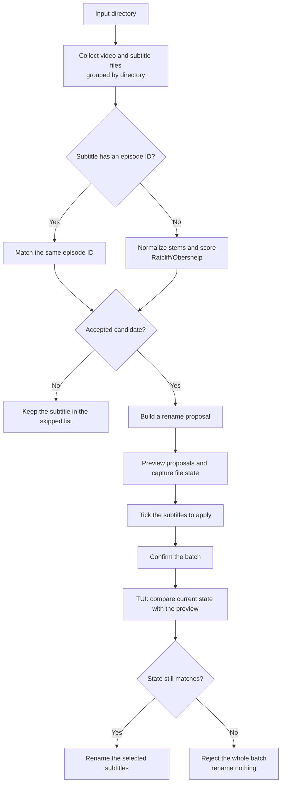

<p align="center">
  <a href="./README.md"><kbd>English</kbd></a>
  <a href="./README.zh-CN.md"><kbd>简体中文</kbd></a>
</p>

<p align="center">
  
</p>

<h1 align="center">beaver</h1>

<p align="center">Rename subtitle files to match the videos beside them.</p>

<p align="center">
  
</p>

beaver scans a video library and proposes names for the subtitle files in the same folders. It
uses directory entries, filenames, extensions, and file metadata for the pre-apply safety check. It
does not open video streams or read subtitle contents. Everything stays local. There is no upload,
cache, or history.

With `--recursive`, beaver also scans subfolders. Matching is still per directory. A subtitle is
never matched with a video from a different folder.

## How the workflow works

The TUI path is the one shown here. The CLI uses the same planner, but its apply path is separate.



The CLI default and `--dry-run` only print the plan. `--apply` plans and applies in one pass, with
an interactive confirmation unless `--yes` is supplied. It does not run the TUI's second
state-check phase. The TUI always checks the selected batch again immediately before renaming.

## TUI

Run `beaver` without a path, or pass one with `beaver --tui`:

```bash
beaver
beaver --tui ~/Videos/Some.Show
```

The interface has four steps. Only the current step is live.

| Step | What happens |
| --- | --- |
| Folder | Type or paste a directory path. Press `o` or click `Browse` to open the folder picker. |
| Rules | Choose `Relaxed`, `Balanced`, or `Cautious`, then choose whether to include subfolders. Changing either rule discards the old preview. |
| Preview | Review proposed renames. All proposals start checked. Move through the list, click a row, or use `Space` to toggle it. Press `s` to inspect skipped subtitles. |
| Apply | Press `a` or the forward button. Beaver asks for confirmation, checks the selected files again, and shows a real progress bar while it renames. |

The TUI is always strict. It never invents a suffix for a taken target name and never overwrites an
existing file. There is no TUI strict switch and no TUI `--force` equivalent.

Mouse input is supported throughout the interface. Left-click a field, control, button, step that
has already been visited, or list row. A click selects a preview row; a second click on the already
selected row toggles its checkbox. The mouse wheel moves the list under it, including the skipped and
folder-picker lists. Keyboard control remains available at every step.

After an apply finishes, the preview is discarded because it no longer describes the files on disk.
The next run starts over and scans again.

### Keyboard shortcuts

| Key | Action |
| --- | --- |
| `Enter` | Move forward. On the confirmation dialog, confirm. On the final step, start over. |
| `←` / `→` or `h` / `l` | Go back or forward one wizard step. |
| `Esc` | Go back, leave the path field, or close the current dialog. |
| `↑` / `↓` or `k` / `j` | Move within the current step or list. |
| `Tab` / `Shift+Tab` | Move to the next or previous control. |
| `Space` | Activate the focused control, including the highlighted preview checkbox. |
| `Home` / `End` or `g` / `G` | Jump to the first or last row in a list. |
| `PgUp` / `PgDn` | Move one page in a list. |
| `Ctrl+U` / `Ctrl+D` | Move half a page up or down in a list. |
| `Ctrl+A` / `Ctrl+R` | Check all or none on the Preview step. |
| `s` | Open the skipped-subtitles list on Preview, or close it. |
| `p` | Rescan the current folder from the Preview step. |
| `a` | Open Apply confirmation for the checked proposals. |
| `o` | Open the folder picker. |
| `i` | Focus the path field. |
| `?` or `F1` | Open the shortcut help. |
| `q` or `Ctrl+C` | Quit. |
| `y` / `n` | Confirm or cancel the Apply dialog. `Esc` and `q` also cancel it. |

While the path field is focused, letters type into the path instead of triggering shortcuts. In
that field, `Ctrl+A` and `Ctrl+E` move to the start and end, `Ctrl+U` clears the line, `Ctrl+K`
deletes the tail, and `Ctrl+W` or `Alt+Backspace` deletes the previous path segment. `Tab`, `Esc`,
or `↓` leaves the field. `Enter` moves on.

## Installation

### Homebrew

For macOS and Linux, the easiest way is Homebrew:

```bash
brew tap softmaxe/tap
brew install beaver
```

This pulls the prebuilt archive from the GitHub release. You do not need Rust installed.

Keep it up to date with:

```bash
brew update
brew upgrade beaver
```

You can also install without tapping first:

```bash
brew install softmaxe/tap/beaver
```

Check that it works:

```bash
beaver --help
```

### From source

You need Rust 1.88 or newer.

Build a release binary:

```bash
cargo build --release
```

The binary is `target/release/beaver`. Install it on your `PATH` with:

```bash
cargo install --path .
```

Then start the TUI:

```bash
beaver
beaver --tui /path/to/library
```

To run without installing, put `cargo run --` before the same arguments. For example `cargo run -- --tui /path/to/library`.

## CLI

### Dry run

No mode flag is also a dry run when a path is supplied:

```bash
beaver /path/to/library
beaver /path/to/library --dry-run
```

Both commands print the plan and leave the files alone.

### Apply

```bash
beaver /path/to/library --apply
beaver /path/to/library --apply --yes
```

Without `--yes`, the CLI asks before it renames. The CLI does not use the TUI's batch re-verification
step. By default it still refuses to overwrite an existing target while applying.

### Important options

| Option | Meaning |
| --- | --- |
| `--tui` | Open the TUI. A supplied path fills its Folder step. |
| `-r`, `--recursive` | Include subfolders in the scan. Matching remains within each folder. |
| `--level relaxed\|balanced\|cautious` | Select the fuzzy threshold. `balanced` is the default. |
| `--min-score SCORE` | Set an explicit fuzzy threshold from `0` to `1`, overriding `--level`. |
| `--video-ext EXT` | Use the supplied video extension set. Repeat it for multiple extensions. A leading dot is optional. |
| `--sub-ext EXT` | Use the supplied subtitle extension set. Repeat it for multiple extensions. A leading dot is optional. |
| `--strict` | Skip a proposal when its plain target name is already taken. |
| `--force` | CLI only. Allow an apply to overwrite an existing target. It conflicts with `--strict`. |
| `--dry-run` | Print the plan without changing anything. This is the default for a path run. |
| `--apply` | Apply the plan after confirmation. |
| `-y`, `--yes` | Skip the CLI apply prompt. |

`--video-ext` and `--sub-ext` are case-insensitive. If they are omitted, beaver considers these
types:

- Video: `.mkv`, `.mp4`, `.avi`, `.mov`, `.wmv`, `.m4v`, `.webm`
- Subtitle: `.ass`, `.srt`, `.ssa`, `.vtt`, `.sub`

## Matching rules

1. **Classify by extension.** Beaver collects recognized video and subtitle files and groups them
   by their parent directory. It does not compare across directories.
2. **Prefer episode IDs.** A subtitle containing `SxxEyy` or `2x01` is matched to a video with the
   same normalized ID, such as `S02E01`. Separators between the parts are allowed. If that ID has
   no matching video, the subtitle is skipped rather than sent through fuzzy matching. If two
   videos claim the same ID, that ID is ambiguous and its subtitle is skipped.
3. **Use fuzzy matching only without an episode ID.** Beaver removes bracketed groups, common release
   metadata, trailing language tags, and filename separators from each stem. It then compares the
   remaining characters with the Ratcliff/Obershelp measure. The best candidate must meet the
   selected threshold and lead the runner-up by at least `0.06`. A near miss stays in the skipped
   list with its best score.

The named fuzzy levels map to fixed thresholds:

| Level | Threshold | Use it when |
| --- | ---: | --- |
| Relaxed | `0.60` | Names are messy and you will review the preview closely. |
| Balanced | `0.72` | You want the default balance between coverage and caution. |
| Cautious | `0.84` | You only want very close fuzzy matches. |

Episode-ID matches ignore the fuzzy threshold.

The normal target is `VideoName.subtitle-extension`. Beaver keeps the subtitle's extension. In
non-strict CLI mode, a taken target first gets a detected language tag when available, then a numeric
suffix. `--strict` skips that collision, and TUI behavior is always strict. `--force` is available
only in the CLI and allows the plain target to replace an existing file.

## Safety and local behavior

- Preview and dry-run never write. Only an apply action can rename files.
- TUI Apply asks for confirmation before starting.
- When the TUI preview is created, each selected source and destination gets a lightweight
  fingerprint. The TUI compares those states immediately before applying. If any selected path has
  changed, the entire selected batch is refused and nothing from that batch is renamed.
- The TUI scans and applies on worker threads, so a large recursive scan does not freeze the
  interface. CLI work runs as a normal command-line operation.
- The program does not upload files and has no cache or history to consult.
- The TUI never overwrites. CLI `--force` is the only overwrite path.

## Try it with a generated library

The script creates a disposable directory with fake videos and subtitles. The video files are
placeholders, not playable containers.

```bash
scripts/make-demo-library.sh
cargo run -- --tui demo-library
```

Turn on `Include subfolders` in Rules to see the nested cases. The generated library includes
episode-ID matches, fuzzy matches at different levels, an absent episode, already matching names,
collision cases, an ambiguous episode ID, CJK names, and subtitles with no video in their folder.

The script accepts an optional target directory and only removes a target it previously marked as
one of its own demo libraries. Re-run it after an apply to restore the original names.

## Source layout

```text
src/
├── planning.rs       # read-only matching and rename planning
├── applying.rs       # state checks, confirmation data, and filesystem renames
├── names.rs          # stem normalization, episode IDs, and language tags
├── similarity.rs     # Ratcliff/Obershelp similarity
├── presentation.rs   # match levels, labels, and demo data
├── paths.rs          # path expansion and display helpers
├── cli.rs            # command-line front-end
└── tui/              # four-step terminal front-end

scripts/
└── make-demo-library.sh
```

## Tests and checks

```bash
cargo test
cargo clippy --all-targets
cargo fmt --check
```

The TUI tests drive key and mouse events through a `ratatui` test backend. CLI tests run the real
binary against temporary directories.

## License

beaver is licensed under [GNU AGPL v3.0 only](./LICENSE).
