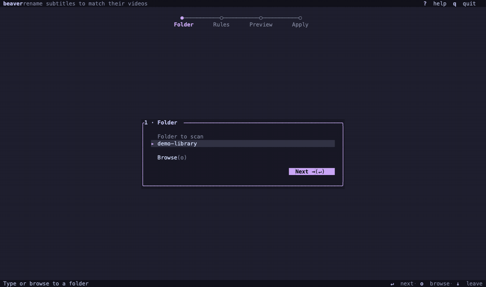

<p align="center">
  
</p>

<h1 align="center">beaver</h1>

<p align="center">
  <a href="README.md"><kbd>English</kbd></a>
  <a href="README.zh-CN.md"><kbd>简体中文</kbd></a>
</p>

让字幕文件名与同目录的视频保持一致。

<p align="center">
  
</p>

beaver 扫描视频库并生成字幕重命名方案。你可以在终端界面中逐项检查，也可以通过 CLI 批量处理或
编写脚本。

- 优先匹配 `S02E01`、`2x01` 等剧集编号，再按文件名相似度匹配。
- 可扫描子目录，但不会匹配不同目录中的文件。
- 只读取文件名和文件元数据，不读取媒体内容，也不上传文件。
- 修改前先预览。TUI 不会覆盖已有文件。

## 安装

### macOS 或 Linux 使用 Homebrew

```bash
brew install softmaxe/tap/beaver
```

后续可通过 `brew upgrade beaver` 更新。

### 下载预编译版本

从 [GitHub Releases](https://github.com/softmaxe/beaver/releases) 下载 Windows、macOS 或 Linux
版本，解压后把 `beaver` 或 `beaver.exe` 放入 `PATH`。

Release binary 尚未签名，macOS Gatekeeper 或 Windows SmartScreen 可能会显示警告。

### 从源码安装

需要 Rust 1.88 或更高版本。

```bash
git clone https://github.com/softmaxe/beaver.git
cd beaver
cargo install --path .
```

运行 `beaver --help` 检查是否安装成功。

## 快速开始

打开终端界面：

```bash
beaver
beaver --tui ~/Videos/Some.Show
```

通过 CLI 预览重命名方案，不修改文件：

```bash
beaver /path/to/library
```

确认后应用方案：

```bash
beaver /path/to/library --apply
```

添加 `--recursive` 可扫描子目录，匹配仍限制在各自目录内。

## 终端界面

TUI 分为四步：

1. **Folder：** 选择要扫描的目录。
2. **Rules：** 选择 `Relaxed`、`Balanced` 或 `Cautious`，并决定是否扫描子目录。
3. **Preview：** 检查重命名方案，取消勾选不想应用的项目。
4. **Apply：** 确认整批操作。beaver 会再次检查已选文件，然后开始重命名。

界面同时支持键盘和鼠标。按 `?` 或 `F1` 查看完整快捷键。常用按键包括：`Enter` 继续，方向键或
`hjkl` 移动，`Space` 切换勾选，`s` 查看跳过的字幕，`q` 退出。

目标文件名被占用时，TUI 不会添加后缀，也不会覆盖已有文件。应用完成后，beaver 会丢弃旧预览，
下次操作将重新扫描目录。

## CLI

传入路径后会使用 CLI。直接传入路径或添加 `--dry-run` 都只打印方案，不修改文件。

```bash
# 仅预览
beaver /path/to/library
beaver /path/to/library --dry-run

# 确认后应用
beaver /path/to/library --apply

# 不询问，直接应用
beaver /path/to/library --apply --yes
```

常用选项：

| 选项 | 作用 |
| --- | --- |
| `--tui` | 打开 TUI，并自动填入传入的路径。 |
| `-r`、`--recursive` | 扫描子目录，匹配仍限制在各自目录内。 |
| `--level relaxed\|balanced\|cautious` | 设置模糊匹配等级，默认是 `balanced`。 |
| `--min-score SCORE` | 设置 `0` 到 `1` 的模糊匹配阈值，覆盖 `--level`。 |
| `--video-ext EXT` | 替换默认视频扩展名，可重复传入多个值。 |
| `--sub-ext EXT` | 替换默认字幕扩展名，可重复传入多个值。 |
| `--strict` | 普通目标文件名已存在时跳过该方案。 |
| `--apply` | 确认后应用方案。 |
| `-y`、`--yes` | 跳过 CLI 确认。 |
| `--force` | 允许 CLI 覆盖已有目标文件，与 `--strict` 互斥。 |

未使用 `--strict` 时，如果目标文件名被占用，beaver 会优先添加识别出的语言标签，否则添加数字
后缀。只有 `--force` 会覆盖文件。

## 匹配规则

beaver 按目录对文件分组，再依次处理每个字幕：

1. 如果字幕名包含 `S02E01` 或 `2x01` 等剧集编号，则匹配编号相同的视频。没有对应视频或编号有
   歧义时跳过。
2. 如果没有剧集编号，则去掉常见发布信息、语言标签、括号内容和分隔符，再使用
   Ratcliff/Obershelp 算法比较文件名相似度。
3. 最佳候选需要达到当前阈值，并且至少领先第二名 `0.06`。

| 等级 | 阈值 | 适用情况 |
| --- | ---: | --- |
| Relaxed | `0.60` | 文件名较乱，并且会仔细检查预览。 |
| Balanced | `0.72` | 一般使用，也是默认选项。 |
| Cautious | `0.84` | 只接受高度相似的文件名。 |

剧集编号匹配不受模糊匹配阈值影响。

默认文件类型：

- 视频：`.mkv`、`.mp4`、`.avi`、`.mov`、`.wmv`、`.m4v`、`.webm`
- 字幕：`.ass`、`.srt`、`.ssa`、`.vtt`、`.sub`

扩展名不区分大小写，重命名后仍保留字幕原有扩展名。

## 安全与隐私

- Preview 和 dry run 不会重命名文件。
- TUI 会先询问确认，再次检查所有已选源文件和目标文件。只要预览后有任一文件发生变化，整批操作
  都会取消。
- CLI 连续执行规划和应用。除非传入 `--yes`，否则会先询问确认；除非传入 `--force`，否则不会
  覆盖已有目标文件。
- 所有处理都在本地完成。beaver 不上传文件，不保留缓存或历史记录，也不会打开视频流或读取字幕
  内容。

## 试用演示目录

仓库内的脚本会创建视频和字幕占位文件，适合安全试跑：

```bash
scripts/make-demo-library.sh
cargo run -- --tui demo-library
```

在 Rules 中启用 `Include subfolders` 可查看嵌套目录示例。Apply 后再次运行脚本即可恢复演示文件名。

## 开发

```bash
cargo test
cargo clippy --all-targets
cargo fmt --check
```

TUI 的视觉和交互说明见 [DESIGN.md](./DESIGN.md)。

## 许可证

beaver 使用 [GNU AGPL v3.0 only](./LICENSE) 许可证。
