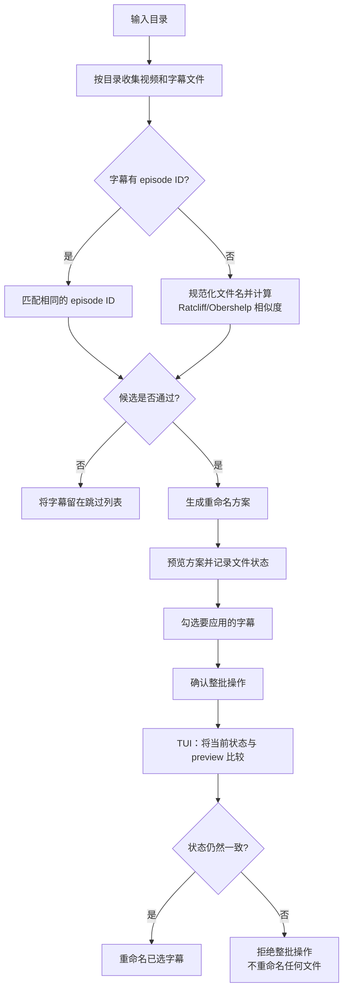

<p align="center">
  
</p>

<h1 align="center">beaver</h1>

<p align="center">
  <a href="README.md"><kbd>English</kbd></a>
  <a href="README.zh-CN.md"><kbd>简体中文</kbd></a>
</p>

让字幕文件名跟随同目录的视频文件。

<p align="center">
  
</p>

beaver 扫描视频库，为同目录中的字幕文件提出重命名方案。它只使用目录项、文件名、扩展名
和应用前检查所需的文件元数据。它不会打开视频流，也不会读取字幕内容。所有处理都在本地
完成，不上传文件，不保留缓存或历史记录。

使用 `--recursive` 后，beaver 也会扫描子目录，但匹配仍按目录进行。字幕不会和其他目录中的
视频匹配。

## 工作流程

下面的流程图描述 TUI 路径。CLI 使用同一个 planner，但应用路径不同。



提供路径时，CLI 不带模式参数和 `--dry-run` 都只打印方案。`--apply` 会规划后直接应用，除非
使用 `--yes`，否则会先询问确认。CLI 不执行 TUI 的第二次状态校验。TUI 则会在重命名前立即
再次检查已选整批文件的状态。

## TUI

直接运行 `beaver`，或者使用 `beaver --tui` 传入目录：

```bash
beaver
beaver --tui ~/Videos/Some.Show
```

界面分四步，每次只操作当前步骤。

| 步骤 | 操作 |
| --- | --- |
| Folder | 输入或粘贴目录路径。按 `o` 或点击 `Browse` 打开目录选择器。 |
| Rules | 选择 `Relaxed`、`Balanced` 或 `Cautious`，再决定是否包含子目录。任一规则改变都会丢弃旧 preview。 |
| Preview | 查看待重命名列表。方案默认全部勾选。可移动到列表、点击行，或按 `Space` 切换勾选。按 `s` 查看被跳过的字幕。 |
| Apply | 按 `a` 或点击前进按钮。beaver 会先要求确认，再检查已选文件，重命名时显示真实进度条。 |

TUI 固定使用 strict 行为。目标文件名被占用时不会悄悄添加后缀，也不会覆盖已有文件。TUI
没有 strict 开关，也不支持 `--force`。

整个界面都支持鼠标。左键可以点击输入框、控件、按钮、已经访问过的步骤，或列表行。点击
预览列表中的行会选中它，再次点击当前已选中的同一行才切换复选框。滚轮会移动当前所在的
列表，包括跳过列表和目录选择器。键盘操作仍然保留。

应用完成后，旧 preview 会被丢弃，因为它已经不能描述磁盘上的文件。下一次操作会从头开始并
重新扫描。

### 快捷键

| 按键 | 操作 |
| --- | --- |
| `Enter` | 前进。确认对话框中表示确认，最后一步表示重新开始。 |
| `←` / `→` 或 `h` / `l` | 后退或前进一个步骤。 |
| `Esc` | 后退、离开路径输入框，或关闭当前对话框。 |
| `↑` / `↓` 或 `k` / `j` | 在当前步骤或列表中移动。 |
| `Tab` / `Shift+Tab` | 移动到下一个或上一个控件。 |
| `Space` | 激活当前控件，包括切换预览列表中高亮行的复选框。 |
| `Home` / `End` 或 `g` / `G` | 跳到列表第一行或最后一行。 |
| `PgUp` / `PgDn` | 在列表中移动一页。 |
| `Ctrl+U` / `Ctrl+D` | 在列表中向上或向下移动半页。 |
| `Ctrl+A` / `Ctrl+R` | 在 Preview 中全选或全不选。 |
| `s` | 在 Preview 中打开跳过列表，再次按下可关闭。 |
| `p` | 从 Preview 重新扫描当前目录。 |
| `a` | 为已勾选方案打开 Apply 确认。 |
| `o` | 打开目录选择器。 |
| `i` | 聚焦路径输入框。 |
| `?` 或 `F1` | 打开快捷键帮助。 |
| `q` 或 `Ctrl+C` | 退出。 |
| `y` / `n` | 确认或取消 Apply 对话框。`Esc` 和 `q` 也会取消。 |

路径输入框获得焦点时，字母会写入路径，而不是触发快捷键。在输入框中，`Ctrl+A` 和 `Ctrl+E`
移动到开头和末尾，`Ctrl+U` 清空整行，`Ctrl+K` 删除光标后的内容，`Ctrl+W` 或
`Alt+Backspace` 删除上一个路径片段。`Tab`、`Esc` 或 `↓` 离开输入框，`Enter` 继续。

## 安装

### Homebrew

macOS 和 Linux 可以直接用 Homebrew：

```bash
brew tap softmaxe/tap
brew install beaver
```

这会从 GitHub release 下载预编译的压缩包，不需要本机装 Rust。

更新：

```bash
brew update
brew upgrade beaver
```

也可以不先 tap：

```bash
brew install softmaxe/tap/beaver
```

验证：

```bash
beaver --help
```

### 从源码安装

需要 Rust 1.88 或更高版本。

构建 release binary：

```bash
cargo build --release
```

产物在 `target/release/beaver`。安装到 `PATH`：

```bash
cargo install --path .
```

启动 TUI：

```bash
beaver
beaver --tui /path/to/library
```

不安装直接运行，把参数放在 `cargo run --` 后面即可，例如 `cargo run -- --tui /path/to/library`。

## CLI

### Dry run

提供路径时，不带模式参数也表示 dry run：

```bash
beaver /path/to/library
beaver /path/to/library --dry-run
```

两条命令都会打印方案，不修改文件。

### Apply

```bash
beaver /path/to/library --apply
beaver /path/to/library --apply --yes
```

不使用 `--yes` 时，CLI 会在重命名前询问确认。CLI 不执行 TUI 的整批二次校验。默认情况下，
应用阶段仍然不会覆盖已有目标文件。

### 重要选项

| 选项 | 含义 |
| --- | --- |
| `--tui` | 打开 TUI。传入的路径会填入 Folder 步骤。 |
| `-r`、`--recursive` | 扫描子目录，但匹配仍限制在各自目录内。 |
| `--level relaxed\|balanced\|cautious` | 选择 fuzzy 阈值，默认是 `balanced`。 |
| `--min-score SCORE` | 设置 `0` 到 `1` 之间的 fuzzy 阈值，覆盖 `--level`。 |
| `--video-ext EXT` | 设置视频扩展名，可重复传入多个值，可带或不带开头的点。 |
| `--sub-ext EXT` | 设置字幕扩展名，可重复传入多个值，可带或不带开头的点。 |
| `--strict` | 普通目标文件名被占用时跳过该方案。 |
| `--force` | 仅 CLI 支持。允许 apply 覆盖已有目标文件，与 `--strict` 互斥。 |
| `--dry-run` | 只打印方案，不修改文件。带路径运行时这是默认行为。 |
| `--apply` | 确认后应用方案。 |
| `-y`、`--yes` | 跳过 CLI 的 apply 确认。 |

`--video-ext` 和 `--sub-ext` 不区分大小写。省略这两个选项时，beaver 识别以下类型：

- 视频：`.mkv`、`.mp4`、`.avi`、`.mov`、`.wmv`、`.m4v`、`.webm`
- 字幕：`.ass`、`.srt`、`.ssa`、`.vtt`、`.sub`

## 匹配规则

1. **按扩展名分类。** Beaver 收集识别到的视频和字幕文件，并按父目录分组。它不会跨目录比较。
2. **优先使用 episode ID。** 字幕文件名中有 `SxxEyy` 或 `2x01` 时，会匹配相同的规范化 ID，
   例如 `S02E01`。两部分之间可以有分隔符。如果该 ID 没有对应视频，字幕会被跳过，不会再
   进入 fuzzy 匹配。如果两个视频声明了同一个 ID，该 ID 会被视为有歧义，相关字幕会被跳过。
3. **没有 episode ID 时才使用 fuzzy matching。** Beaver 会去掉方括号、圆括号或花括号中的组名、
   常见发布元数据、末尾语言标签和文件名分隔符，然后使用 Ratcliff/Obershelp 比较剩余字符。
   最佳候选必须达到当前阈值，并且至少领先第二名 `0.06`。接近但未通过的结果会留在跳过
   列表中，并显示最佳分数。

三个 fuzzy level 对应固定阈值：

| Level | 阈值 | 适用情况 |
| --- | ---: | --- |
| Relaxed | `0.60` | 文件名比较乱，但会认真检查 preview。 |
| Balanced | `0.72` | 默认取值，在覆盖率和谨慎之间取平衡。 |
| Cautious | `0.84` | 只接受非常接近的 fuzzy match。 |

episode-ID match 不受 fuzzy 阈值影响。

默认目标名是 `VideoName.subtitle-extension`，并保留字幕原有扩展名。CLI 的非 strict 模式中，
如果目标已被占用，会先尝试字幕识别出的语言标签，再尝试数字后缀。`--strict` 会直接跳过冲突，
TUI 始终使用这种 strict 行为。`--force` 只在 CLI 中可用，并允许普通目标名替换已有文件。

## 安全行为与本地处理

- Preview 和 dry run 不写入文件。只有 apply 操作会重命名文件。
- TUI 的 Apply 开始前会要求确认。
- TUI 创建 preview 时，会为每个已选源文件和目标路径记录轻量指纹。应用前会立即比较这些状态。
  只要任一已选路径发生变化，整批已选操作都会被拒绝，该批次不会重命名任何文件。
- TUI 的扫描和应用运行在 worker thread 上，大型递归扫描不会冻结界面。CLI 则作为普通命令行
  操作运行。
- 程序不会上传文件，也没有需要读取的缓存或历史记录。
- TUI 永不覆盖文件。CLI `--force` 是唯一的覆盖路径。

## 用生成的 library 试跑

脚本会创建一个可丢弃的目录，其中放入假的视频和字幕文件。视频文件只是占位内容，不是可播放的
容器。

```bash
scripts/make-demo-library.sh
cargo run -- --tui demo-library
```

在 Rules 中打开 `Include subfolders`，可以看到嵌套目录的案例。生成的 library 包含 episode-ID
匹配、不同强度的 fuzzy match、缺失 episode、已经匹配的文件名、目标冲突、歧义 episode ID、
CJK 文件名，以及所在目录没有视频的字幕。

脚本接受可选的目标目录，并且只会删除它自己此前标记过的 demo library。完成 apply 后重新运行脚本，
即可恢复初始文件名。

## 源码结构

```text
src/
├── planning.rs       # 只读匹配和重命名规划
├── applying.rs       # 状态检查、确认数据和文件重命名
├── names.rs          # stem 规范化、episode ID 和语言标签
├── similarity.rs     # Ratcliff/Obershelp 相似度
├── presentation.rs   # match level、显示文本和 demo 数据
├── paths.rs          # 路径展开和显示辅助函数
├── cli.rs            # 命令行前端
└── tui/              # 四步终端前端

scripts/
└── make-demo-library.sh
```

## 测试与检查

```bash
cargo test
cargo clippy --all-targets
cargo fmt --check
```

TUI 测试通过 `ratatui` test backend 驱动键盘和鼠标事件。CLI 测试使用真实 binary，针对临时目录
运行。

## 许可证

beaver 使用 [GNU AGPL v3.0 only](./LICENSE) 许可证。
